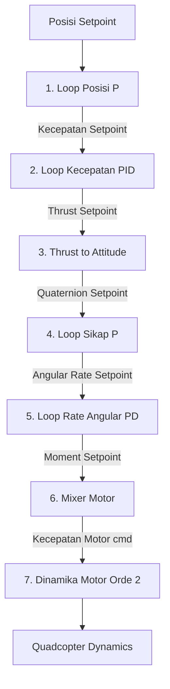

# Simulasi Multi-Quadcopter Terkoordinasi: IAPF vs ERC

Sistem simulasi terdistribusi untuk kawanan (*swarm*) multi-quadcopter homogen (5 agen) yang dirancang menggunakan paradigma Pemrograman Berorientasi Objek (OOP) berbasis Python. Repositori ini mengintegrasikan pemodelan dinamika white-box quadcopter (menggunakan **Metode Kane**), arsitektur kontrol bertingkat (**Cascaded PID**), serta algoritma navigasi kawanan terdesentralisasi: **Improved Artificial Potential Field (IAPF)** dan **Event-Based Reconfiguration Control (ERC)**.

---

## Daftar Isi
1. [Gambaran Umum Proyek](#1-gambaran-umum-proyek)
2. [Model Matematika Quadcopter (Metode Kane)](#2-model-matematika-quadcopter-metode-kane)
3. [Arsitektur Low-Level Controller (Cascaded PID)](#3-arsitektur-low-level-controller-cascaded-pid)
4. [Algoritma Koordinasi Multi-Agent](#4-algoritma-koordinasi-multi-agent)
5. [Skenario Simulasi (Rintangan & Angin)](#5-skenario-simulasi-rintangan--angin)
6. [Analisis Hasil & Perbandingan Performa](#6-analisis-hasil--perbandingan-performa)
7. [Rencana Implementasi & Validasi Fisik](#7-rencana-implementasi--validasi-fisik)
8. [Panduan Memulai (Getting Started)](#8-panduan-memulai-getting-started)

---

## 1. Gambaran Umum Proyek

Proyek ini bertujuan untuk mengatasi tantangan koordinasi kawanan quadcopter dalam menavigasi lingkungan yang kompleks dan dinamis. Kawanan harus mampu mempertahankan formasi geometris, menghindari tabrakan antar-agen, menghindari rintangan statis, dan beradaptasi terhadap penyempitan lingkungan (celah sempit) serta gangguan angin eksternal.

Sistem dirancang dengan arsitektur kontrol bertingkat secara terdesentralisasi:
*   **High-Level Planner**: Menghasilkan setpoint posisi referensi secara real-time untuk masing-masing agen berdasarkan informasi sensor lokal dan interaksi agen. Logika ini dijalankan dalam kelas [MultiAgentMethod di MultiAgentIAPF.py](file:///run/media/izmaherdian/Windows-SSD/Izma_S2_InstrumentasiKontrol_ITB/Akademik/Project%20S1/MultiAgentSim/Agent/MultiAgentIAPF.py) atau [MultiAgentMethod di MultiAgentERC.py](file:///run/media/izmaherdian/Windows-SSD/Izma_S2_InstrumentasiKontrol_ITB/Akademik/Project%20S1/MultiAgentSim/Agent/MultiAgentERC.py).
*   **Low-Level Controller**: Berfungsi mengendalikan bodi fisik quadcopter agar melacak posisi referensi tersebut di tengah inersia dan gangguan eksternal. Sinyal kontrol dikirim ke aktuator motor dalam bentuk perintah kecepatan rotor ($w_{cmd}$). Algoritma kontroler ini diimplementasikan dalam kelas [QuadControl.py](file:///run/media/izmaherdian/Windows-SSD/Izma_S2_InstrumentasiKontrol_ITB/Akademik/Project%20S1/MultiAgentSim/Agent/QuadControl.py).
*   **Quadcopter Plant**: Merepresentasikan dinamika fisik quadcopter (DJI F450) dan aktuator motor. Pemodelan diturunkan secara analitis dan numerik dalam kelas [QuadDynamics.py](file:///run/media/izmaherdian/Windows-SSD/Izma_S2_InstrumentasiKontrol_ITB/Akademik/Project%20S1/MultiAgentSim/Agent/QuadDynamics.py) dengan parameter motor yang didefinisikan secara khusus.

---

## 2. Model Matematika Quadcopter (Metode Kane)

Model dinamika quadcopter diturunkan menggunakan **Metode Kane** (Thomas R. Kane, 1985), yang diimplementasikan secara sistematis melalui modul *Python Dynamics* (PyDy) pada berkas [Quad_3D_frd_NED_Quat.py](file:///run/media/izmaherdian/Windows-SSD/Izma_S2_InstrumentasiKontrol_ITB/Akademik/Project%20S1/MultiAgentSim/Agent/ModelSystemQuad/Quad_3D_frd_NED_Quat.py).

### Mengapa Metode Kane?
Dibandingkan dengan formulasi mekanika klasik lainnya, Metode Kane menawarkan efisiensi komputasi yang tinggi untuk sistem multibodi non-linear:
1.  **vs Newton-Euler**: Newton-Euler memerlukan perhitungan gaya reaksi internal (interaksi antarbodi) yang tidak berkontribusi pada gerakan sistem, sehingga menambah beban komputasi secara signifikan. Metode Kane mengabaikan gaya-gaya internal yang tidak bekerja ini secara alami.
2.  **vs Lagrange**: Lagrange memerlukan derivasi energi kinetik dan potensial yang kompleks, diikuti oleh diferensiasi parsial yang sangat panjang dan rawan kesalahan simbolik. Selain itu, Lagrange menghasilkan persamaan dalam bentuk percepatan koordinat umum ($\ddot{q}$) yang membutuhkan inversi matriks inersia simbolik yang sangat besar.
3.  **Kelebihan Kane**: Kane memperkenalkan konsep **Kecepatan Umum (Generalized Speeds - $u$)** yang secara langsung menyederhanakan representasi kinematika, terutama pada rotasi 3D. Persamaan Kane dibentuk dari proyeksi gaya aktif ($\mathbf{F}_r$) dan gaya inersia ($\mathbf{F}_r^*$) langsung pada arah kecepatan umum parsial ($\mathbf{v}_r$), menghasilkan persamaan gerak tingkat pertama yang linier terhadap turunan kecepatan umum ($\dot{u}$).

### Kerangka Acuan (Coordinate Frames)
Sistem menggunakan dua kerangka acuan utama (menurut standar penerbangan):
1.  **Kerangka Inersia ($N$)**: Menggunakan orientasi **NED** (North, East, Down). Posisi dinyatakan sebagai $(x, y, z)$. Sumbu $+z$ menunjuk ke bawah (gravitasi bernilai positif).
2.  **Kerangka Bodi ($B$)**: Menggunakan orientasi **FRD** (Front, Right, Down). Pusat massa berada di $B_{cm}$.
3.  **Kerangka Angin ($W$)**: Digunakan untuk memodelkan interaksi aerodinamis.

### Variabel Keadaan (State Variables)
Vektor keadaan lengkap dari plant quadcopter ($\mathbf{s}_{plant}$) terdiri dari 13 variabel keadaan:
$$\mathbf{s}_{plant}(t) = \begin{bmatrix} x & y & z & q_w & q_x & q_y & q_z & u_x & u_y & u_z & \omega_\phi & \omega_\theta & \omega_\psi \end{bmatrix}^T$$

1.  **Koordinat Umum ($\mathbf{q}_{ind}$)**:
    *   Posisi pusat massa relatif terhadap $N_o$: $\mathbf{p} = \begin{bmatrix} x & y & z \end{bmatrix}^T$.
    *   Orientasi bodi $B$ terhadap $N$ dinyatakan menggunakan unit quaternion $\mathbf{q} = \begin{bmatrix} q_w & q_x & q_y & q_z \end{bmatrix}^T$ untuk menghindari singularitas (*gimbal lock*). Memenuhi kendala normalisasi: $q_w^2 + q_x^2 + q_y^2 + q_z^2 = 1$.
2.  **Kecepatan Umum ($\mathbf{u}_{ind}$)**:
    *   Kecepatan linear dalam $N$: $\mathbf{v} = \begin{bmatrix} u_x & u_y & u_z \end{bmatrix}^T$ di mana $u_x = \dot{x}$, $u_y = \dot{y}$, dan $u_z = \dot{z}$.
    *   Kecepatan sudut bodi relatif terhadap $N$, dinyatakan dalam kerangka $B$: $\boldsymbol{\omega} = \begin{bmatrix} \omega_\phi & \omega_\theta & \omega_\psi \end{bmatrix}^T$ (atau biasa dikenal sebagai $p, q, r$).

### Persamaan Diferensial Kinematik
Hubungan antara turunan quaternion ($\dot{\mathbf{q}}$) dan kecepatan sudut bodi ($\boldsymbol{\omega}$) dinyatakan sebagai:
$$\begin{bmatrix} \dot{q}_w \\ \dot{q}_x \\ \dot{q}_y \\ \dot{q}_z \end{bmatrix} = \frac{1}{2} \begin{bmatrix} -q_x & -q_y & -q_z \\ q_w & -q_z & q_y \\ q_z & q_w & -q_x \\ -q_y & q_x & q_w \end{bmatrix} \begin{bmatrix} \omega_\phi \\ \omega_\theta \\ \omega_\psi \end{bmatrix}$$

### Persamaan Dinamika
Gaya dan torsi yang bekerja pada quadcopter dikumpulkan dalam `ForceList`:
*   **Gaya Gravitasi**: $\mathbf{F}_g = m_B g \hat{\mathbf{n}}_z$ (arah positif ke bawah dalam NED).
*   **Gaya Dorong Aktuator**: Setiap motor $i$ menghasilkan thrust $\mathbf{T}_{M_i} = -T_i \hat{\mathbf{b}}_z$ (di mana $T_i = k_{Th} w_i^2$). Letak motor $M_i$ relatif terhadap $B_{cm}$ dikonfigurasi dalam susunan "X":
    $$\mathbf{p}_{M1} = d_{xm}\hat{\mathbf{b}}_x - d_{ym}\hat{\mathbf{b}}_y - d_{zm}\hat{\mathbf{b}}_z \quad \text{(Depan-Kiri)}$$
    $$\mathbf{p}_{M2} = d_{xm}\hat{\mathbf{b}}_x + d_{ym}\hat{\mathbf{b}}_y - d_{zm}\hat{\mathbf{b}}_z \quad \text{(Depan-Kanan)}$$
    $$\mathbf{p}_{M3} = -d_{xm}\hat{\mathbf{b}}_x + d_{ym}\hat{\mathbf{b}}_y - d_{zm}\hat{\mathbf{b}}_z \quad \text{(Belakang-Kanan)}$$
    $$\mathbf{p}_{M4} = -d_{xm}\hat{\mathbf{b}}_x - d_{ym}\hat{\mathbf{b}}_y - d_{zm}\hat{\mathbf{b}}_z \quad \text{(Belakang-Kiri)}$$
*   **Torsi Reaksi Aktuator**: $\boldsymbol{\tau}_{M_i} = (-1)^i \tau_i \hat{\mathbf{b}}_z$ di mana $\tau_i = k_{To} w_i^2$.
*   **Gaya Hambat Aerodinamis**: $\mathbf{F}_{drag, j} = -C_d \text{sign}(v_{wind, j}) v_{wind, j}^2 \hat{\mathbf{n}}_j$ untuk $j \in \{x, y, z\}$.
*   **Torsi Giroskopik Rotor**: Akibat efek presesi rotor yang berputar cepat:
    $$\boldsymbol{\tau}_{gyro} = -I_{Rzz} (\boldsymbol{\omega} \times \Omega_{net} \hat{\mathbf{b}}_z)$$
    di mana $\Omega_{net} = w_1 - w_2 + w_3 - w_4$ adalah kecepatan bersih putaran rotor.

---

## 3. Arsitektur Low-Level Controller (Cascaded PID)

Untuk melacak setpoint posisi dari High-Level Planner, dikembangkan kontroler bertingkat (*cascaded*) dengan arsitektur loop tertutup berikut (diimplementasikan pada [QuadControl.py](file:///run/media/izmaherdian/Windows-SSD/Izma_S2_InstrumentasiKontrol_ITB/Akademik/Project%20S1/MultiAgentSim/Agent/QuadControl.py)):



### Rincian Tahapan Kontrol
1.  **Loop Posisi (P)**: Mengoreksi error posisi untuk menghasilkan setpoint kecepatan linear $\mathbf{v}_{sp}$.
2.  **Loop Kecepatan (PID/PD)**: Mengoreksi error kecepatan linear. Outputnya adalah total gaya dorong target $\mathbf{T}_{sp}$ (termasuk kompensasi gaya gravitasi $m_B g$ sebagai feed-forward). Dilengkapi dengan anti-windup integrasi.
3.  **Konversi Thrust ke Attitude**: Mengonversi vektor thrust $\mathbf{T}_{sp}$ dan sudut yaw keinginan ($\psi_{sp}$) menjadi unit quaternion target ($\mathbf{q}_d$).
4.  **Loop Sikap/Attitude (P)**: Menghitung error orientasi dalam quaternion ($\mathbf{q}_e = \mathbf{q}^{-1} \otimes \mathbf{q}_d$) untuk menghasilkan setpoint kecepatan sudut bodi $\boldsymbol{\omega}_{sp}$.
5.  **Loop Rate Angular (PD)**: Mengoreksi error kecepatan sudut ($\boldsymbol{\omega}_{error} = \boldsymbol{\omega}_{sp} - \boldsymbol{\omega}$) untuk menghasilkan torsi/momen kontrol bodi ($\boldsymbol{\tau}_{cmd}$).
6.  **Mixer Motor**: Mengalokasikan total gaya thrust ($F_{total}$) dan momen kontrol ($\tau_\phi, \tau_\theta, \tau_\psi$) menjadi perintah kuadrat kecepatan motor ($w_{cmd}^2$).
7.  **Dinamika Motor**: Dinamika motor dimodelkan sebagai sistem orde kedua dengan batas saturasi kecepatan minimum ($75\text{ rad/s}$) dan maksimum ($925\text{ rad/s}$), serta waktu tunda aktuator ($\tau = 0.015\text{ s}$).

### Parameter Kontrol (Gains) yang Digunakan
| Parameter Loop | Proportional ($K_p$) | Integral ($K_i$) | Derivative ($K_d$) | Batas Saturasi (Limit) |
| :--- | :---: | :---: | :---: | :--- |
| **Posisi ($x, y$)** | 1.5 | - | - | Kecepatan: $\pm 5.0\text{ m/s}$ |
| **Posisi ($z$)** | 1.5 | - | - | Kecepatan: $\pm 5.0\text{ m/s}$ |
| **Kecepatan ($x, y$)**| 5.0 | 5.0 | 0.5 | Sudut Kemiringan (*Tilt*): $50^\circ$ |
| **Kecepatan ($z$)** | 4.0 | 5.0 | 0.5 | Thrust total: $0.1\times 4 \to 9.18\times 4\text{ N}$|
| **Sikap ($\phi, \theta$)**| 8.0 | - | - | Rate angular: $\pm 200^\circ\text{/s}$ |
| **Sikap ($\psi$)** | 1.5 | - | - | Rate angular: $\pm 150^\circ\text{/s}$ |
| **Rate ($\phi, \theta$)**| 1.5 | - | 0.04 | Momen torsi aktuator |
| **Rate ($\psi$)** | 1.0 | - | 0.10 | Momen torsi aktuator |

---

## 4. Algoritma Koordinasi Multi-Agent

Dua strategi planner tingkat tinggi diimplementasikan untuk navigasi kawanan:

### 4.1 Improved Artificial Potential Field (IAPF)
Algoritma IAPF merumuskan pergerakan kawanan secara terdesentralisasi berdasarkan superposisi medan gaya virtual. Vektor gaya virtual ini direpresentasikan langsung sebagai perintah kecepatan target ($\mathbf{v}_{ref}^{IAPF}$) untuk low-level controller:
$$\mathbf{v}_{ref}^{IAPF} = \mathbf{v}_i^{mig} + \mathbf{v}_{oi}^{obs} + \mathbf{v}_{ii}^{col} + \mathbf{v}_i^{form}$$

Di mana komponen-komponennya didefinisikan sebagai:
1.  **Gaya Migrasi Target ($\mathbf{v}_i^{mig}$)**: Menarik kawanan ke titik tujuan akhir.
2.  **Gaya Tolak Rintangan ($\mathbf{v}_{oi}^{obs}$)**: Menghindari tabrakan dengan rintangan statis terdekat (aktif jika jarak $< R_{alert} = 0.6\text{ m}$).
3.  **Gaya Tolak Tabrakan Agen ($\mathbf{v}_{ii}^{col}$)**: Menghindari tabrakan antar-quadcopter tetangga (aktif jika jarak $< R_{alert} = 0.6\text{ m}$).
4.  **Gaya Penjagaan Formasi ($\mathbf{v}_i^{form}$)**: Menjaga susunan geometri kawanan dengan menarik agen menuju posisi relatif idealnya terhadap tetangga:
    $$\mathbf{v}_i^{form} = k_{form} \sum_{j=1, j \neq i}^{N} \left[ (\mathbf{p}_j - \mathbf{p}_i) - \kappa (\boldsymbol{\delta}_j^* - \boldsymbol{\delta}_i^*) \right]$$
    di mana $\kappa$ adalah faktor skala formasi statis, dan $\boldsymbol{\delta}_j^* - \boldsymbol{\delta}_i^*$ adalah vektor posisi relatif bodi ideal.

### 4.2 Event-Based Reconfiguration Control (ERC)
Strategi ERC mengatasi kelemahan utama IAPF (statis dan kaku) dengan memperkenalkan **State Machine** navigasi yang adaptif dan rekonfigurasi formasi dinamis.

#### 1. State Machine Misi:
*   **TAKEOFF Mode**: Seluruh agen lepas landas secara vertikal ke ketinggian jelajah ($z_{target} = -2.0\text{ m}$). Hanya perilaku takeoff dan penghindaran tabrakan nirkabel yang aktif. Transisi ke **MISSION Mode** dilakukan secara serentak hanya ketika kondisi berikut terpenuhi untuk semua agen:
    $$|z_i(t) - z_{target}| \leq 0.1\text{ m}, \quad \forall i$$
*   **MISSION Mode**: Mengaktifkan koordinasi spasial penuh (IAPF, rekonfigurasi, atau tailgating).

#### 2. Logika Peralihan Mode pada Mission Mode:
Dalam Mission Mode, agen secara dinamis memilih perilaku berdasarkan kondisi geometri celah di depannya. Total kecepatan target adalah:
$$\mathbf{v}_{ref}^{ERC} = \mathbf{v}_i^{mig} + \mathbf{v}_{oi}^{obs} + \mathbf{v}_{ii}^{col} + \sigma_i \mathbf{v}_i^{form} + (1 - \sigma_i)\mathbf{v}_i^{tail}$$

Fungsi switching $\sigma_i$ bernilai:
*   $\sigma_i = 1$: **Formation Mode** (mengikuti formasi).
*   $\sigma_i = 0$: **Tailgating Mode** (berbaris satu-satu mengekor pemimpin).

Peralihan ini didasarkan pada **Lebar Lingkungan Bebas ($w_e$)** yang diestimasi secara lokal:
1.  **Estimasi Lebar Lingkungan ($w_e$)**: Agen memproyeksikan jarak antara titik rintangan terdekat di sisi kiri ($\mathbf{o}_l$) dan kanan ($\mathbf{o}_r$) pada sumbu yang tegak lurus dengan arah gerakan kawanan ($\mathbf{u}_{ref}^\perp$):
    $$w_e = \left| \left\langle (\mathbf{o}_r - \mathbf{o}_l), \mathbf{u}_{ref}^\perp \right\rangle \right|$$
2.  **Penskalaan Formasi Dinamis**: Jika celah menyempit namun masih cukup untuk formasi yang diperkecil ($w_e - 2R_{robot} < w_f$, di mana $w_f$ adalah lebar nominal formasi), faktor skala formasi $\kappa$ diturunkan secara mulus:
    $$\kappa = \frac{w_e - 2R_{robot}}{w_f}$$
3.  **Pemicu Transisi ke Tailgating ($\sigma_i = 0$)**: Jika lebar lingkungan lebih kecil dari ambang kritis keselamatan:
    $$w_e \leq \alpha \cdot R_{robot}$$
    di mana $R_{robot} = 0.2\text{ m}$ dan $\alpha = 8$ (Ambang batas kritis $= 1.6\text{ m}$).
4.  **Logika Pemilihan Pemimpin (Leader Election)**: Saat beralih ke tailgating, agen secara otomatis mencari tetangga terdekat di depannya sebagai pemimpin ($l_i$) berdasarkan proyeksi gerak:
    $$l_i = \text{arg}\min_{j: p_{ij} > 0} p_{ij} \quad \text{di mana } p_{ij} = \langle (\mathbf{p}_j - \mathbf{p}_i), \mathbf{u}_{ref} \rangle$$
    Jika tidak ada agen lain di depan ($l_i = -1$), agen tersebut bertindak sebagai pemimpin barisan kawanan.

---

## 5. Skenario Simulasi (Rintangan & Angin)

Simulator menyediakan beberapa skenario lingkungan pada [Obstacles.py](file:///run/media/izmaherdian/Windows-SSD/Izma_S2_InstrumentasiKontrol_ITB/Akademik/Project%20S1/MultiAgentSim/Environment/Obstacles.py) dan [Wind.py](file:///run/media/izmaherdian/Windows-SSD/Izma_S2_InstrumentasiKontrol_ITB/Akademik/Project%20S1/MultiAgentSim/Environment/Wind.py):

### Skema Rintangan (Obstacle Schemes)
*   **Scheme 1 (Penghindaran Dasar)**: Terdiri dari 8 rintangan berbentuk poligon acak dengan tinggi bervariasi ($4.0\text{ m}$ hingga $7.5\text{ m}$) yang tersebar di sepanjang jalur navigasi.
*   **Scheme 2 (Celah Sempit)**: Terdiri dari dua dinding pembatas miring yang membentuk saluran penyempitan (lebar celah di tengah hanya $1.0\text{ m}$).
*   **Scheme 3 (U-Trap)**: Rintangan berbentuk kantong mati "U" untuk menguji batas kemampuan navigasi lokal.

### Model Angin (Wind Models)
*   **FIXED**: Kecepatan angin konstan $1.0\text{ m/s}$ berlawanan arah dengan gerak kawanan (azimuth $180^\circ$).
*   **GUST**: Hembusan angin pulsatif periodik (siklus 10 detik: aktif selama 4 detik, mati selama 6 detik). Ketika aktif, kecepatan angin berosilasi dengan amplitudo $2.0\text{ m/s}$ di atas kecepatan dasar $2.0\text{ m/s}$ (kecepatan puncak mencapai $4.0\text{ m/s}$).

---

## 6. Analisis Hasil & Perbandingan Performa

Berdasarkan pengujian komparatif yang dilakukan pada platform simulasi, didapatkan kesimpulan performa berikut:

### 1. Keunggulan ERC di Celah Sempit (Skenario 2)
*   **IAPF (Gagal)**: Kawanan dengan strategi IAPF tidak mampu melewati celah sempit karena lebar formasi kaku ($2.0\text{ m}$) lebih besar dari lebar celah ($1.0\text{ m}$). Gaya tolak dari dinding celah menyeimbangkan gaya migrasi ke depan, menyebabkan kawanan mandek (*stuck*) dan melayang tanpa batas waktu di mulut celah.
*   **ERC (Sukses)**: Kawanan dengan strategi ERC berhasil melewati celah sempit dengan waktu penyelesaian misi **59.735 detik**. Sekitar detik ke-32, saat mendekati celah, sistem menyusutkan faktor skala $\kappa$ hingga mencapai batas minimal dan memicu transisi mode $\sigma_i = 0$ (tailgating). Kawanan berbaris satu-satu untuk melewati celah, lalu setelah keluar dari celah (detik ke-48), kembali ke mode formasi dan memulihkan susunan V-shape sepenuhnya. Tercatat performa navigasi yang sangat baik: $\bar{\text{RMSE}}_{total} = 0.692\text{ m}$ dan indeks keteraturan rata-rata $\bar{\Phi} = 0.878$.

### 2. Robustness Terhadap Gangguan Angin Gust (Skenario 3)
*   Ketika gangguan angin model **GUST** diterapkan pada skenario celah sempit menggunakan strategi ERC, kawanan tetap berhasil melewati celah dan menyelesaikan misi dalam waktu **59.735 detik** (sama persis dengan kondisi tanpa angin).
*   Meskipun hembusan angin periodik menyebabkan fluktuasi kecepatan dan deviasi spasial sesaat (RMSE naik tipis menjadi $0.694\text{ m}$), koordinasi tetap terjaga kohesif ($\bar{\Phi} = 0.925$).
*   Analisis usaha kontrol menunjukkan fluktuasi osilasi yang sangat tinggi pada kecepatan rotor. Hal ini menunjukkan bahwa Low-Level Controller berhasil meredam efek gangguan angin secara aktif pada tingkat aktuator motor DC, sehingga lintasan fisik luar quadcopter tetap mulus.

### 3. Batas Kemampuan pada Jebakan U-Trap (Skenario 4)
*   Sistem dengan strategi ERC **gagal** menyelesaikan misi pada skenario U-Trap dan terjebak di dalam kantong mati. Hal ini terjadi karena logika pendeteksian celah ERC murni dirancang secara lateral (mendeteksi rintangan di sisi kiri/kanan arah gerak). Ketika menghadapi dinding buntu tepat di depan, transisi tailgating tidak terpicu, dan agen mengalami kebuntuan akibat *local minima* medan potensial.

### 4. Navigasi Waypoint & Lintasan Melingkar (Skenario 5 & 6)
*   Sistem berhasil menyelesaikan navigasi waypoint (5 titik) dalam waktu **76.695 detik** dengan $\bar{\text{RMSE}}_{total} = 0.338\text{ m}$ dan lintasan melingkar kontinu (radius $4.0\text{ m}$) dalam **97.795 detik** dengan $\bar{\text{RMSE}}_{total} = 0.193\text{ m}$. Orientasi formasi berputar dinamis secara mulus mengikuti arah garis singgung lintasan.

---

## 7. Rencana Implementasi & Validasi Fisik

Untuk memvalidasi algoritma simulasi di dunia nyata, dirancang rencana implementasi perangkat keras bertahap menggunakan arsitektur berikut:

### Stack Perangkat Keras (Hardware Stack)
*   **Onboard Computer (OBC)**: Nvidia Jetson Nano (menjalankan ROS/ROS2, menangani algoritma High-Level Planner IAPF/ERC secara terdesentralisasi).
*   **Flight Controller (FC)**: Pixhawk (menjalankan firmware PX4, menangani low-level cascaded PID attitude/rate control).
*   **Sensor Posisi/Lokalisasi**: Modul UWB (Ultra-Wideband) seperti Decawave DWM1000 untuk estimasi posisi relatif antar-agen dengan presisi tinggi di area indoor, atau RTK-GPS untuk outdoor.
*   **Sensor Penghindar Rintangan**: Mini LiDAR 2D/3D (misalnya RPLiDAR) pada setiap quadcopter untuk mendeteksi rintangan secara lokal dan mengestimasi lebar lingkungan bebas ($w_e$).
*   **Komunikasi Nirkabel**: Wi-Fi Mesh menggunakan modul transceiver nirkabel untuk komunikasi nirkabel terdistribusi antar-OBC Jetson Nano.

### 4 Fase Validasi Fisik
```
[ Fase 1: Agen Andal ] ──> [ Fase 2: Indra Kawanan ] ──> [ Fase 3: Otak Kolektif ] ──> [ Fase 4: Uji Bertahap ]
```
1.  **Fase 1: Membuat Satu Agen yang Andal**
    *   Menginstal firmware PX4 pada Pixhawk Flight Controller.
    *   Melakukan tuning parameter cascaded PID internal pada testbench fisik (rate dan attitude tuning).
    *   Membangun komunikasi offboard stabil antara Jetson Nano dan Pixhawk menggunakan protokol MAVLink (melalui MAVROS atau PX4-ROS2 Bridge).
2.  **Fase 2: Membuat "Indra" Kawanan**
    *   Integrasi sensor lokalisasi UWB untuk mendapatkan posisi relatif real-time antar-drone.
    *   Membangun jaringan Wi-Fi Mesh terdistribusi agar setiap drone dapat saling bertukar data keadaan (posisi dan kecepatan).
    *   Integrasi LiDAR pada Jetson Nano untuk mendeteksi dinding/rintangan secara real-time.
3.  **Fase 3: Menanamkan Otak Kolektif**
    *   Mentransfer algoritma High-Level Planner terdesentralisasi (IAPF dan ERC) ke dalam skrip ROS2 node di Jetson Nano.
    *   Melakukan simulasi Hardware-in-the-Loop (HITL) menggunakan simulator Gazebo/PX4 untuk memverifikasi logika kode di OBC sebelum penerbangan nyata.
4.  **Fase 4: Pengujian Penerbangan Bertahap**
    *   *Uji 1 Drone*: Tes hover stabil dan pelacakan waypoint sederhana menggunakan kontrol offboard Jetson.
    *   *Uji 2 Drone*: Tes penghindaran tabrakan dinamis berbasis medan potensial menggunakan data lokalisasi UWB.
    *   *Uji 3-5 Drone*: Tes pembentukan formasi statis (V-shape) di udara bebas.
    *   *Uji Navigasi Lintasan*: Mengarahkan kawanan melintasi lintasan waypoint dengan orientasi formasi dinamis.
    *   *Uji Celah Sempit*: Menghadapkan kawanan 5 drone pada celah buatan fisik untuk memvalidasi algoritma rekonfigurasi ERC (transisi ke barisan tunggal dan pemulihan formasi).

---

## 8. Panduan Memulai (Getting Started)

### Prasyarat (Dependencies)
Pastikan Anda menggunakan Python 3.12 (atau versi yang kompatibel). Instal paket-paket pustaka utama berikut yang terdapat pada berkas [requirement.txt](file:///run/media/izmaherdian/Windows-SSD/Izma_S2_InstrumentasiKontrol_ITB/Akademik/Project%20S1/MultiAgentSim/requirement.txt):
```bash
pip install numpy==1.26.4 scipy==1.15.2 sympy==1.13.3 matplotlib==3.9.4
```

### Cara Menjalankan Simulasi
Simulasi utama diluncurkan melalui berkas [main.py](file:///run/media/izmaherdian/Windows-SSD/Izma_S2_InstrumentasiKontrol_ITB/Akademik/Project%20S1/MultiAgentSim/main.py). 

Untuk memilih konfigurasi pengujian:
1.  Buka berkas konfigurasi [MultiAgentConfig.py](file:///run/media/izmaherdian/Windows-SSD/Izma_S2_InstrumentasiKontrol_ITB/Akademik/Project%20S1/MultiAgentSim/Agent/MultiAgentConfig.py).
2.  Sesuaikan parameter simulasi pada fungsi inisialisasi:
    *   `self.CONTROLLER`: Pilih `'erc'` untuk Event-Based Reconfiguration Control atau `'iapf'` untuk Improved APF.
    *   `self.OBSTACLE_SCHEME`: Pilih `'scheme1'` (penghindaran dasar), `'scheme2'` (celah sempit), `'scheme3'` (U-trap), atau `'NONE'`.
    *   `self.WIND_TYPE`: Pilih `'NONE'` (tanpa angin), `'FIXED'` (angin konstan), atau `'GUST'` (hembusan angin gust).
    *   `self.PATH_TYPE`: Pilih `'goal'` (navigasi tujuan tunggal), `'multi-goal'` (waypoint), atau `'circular'` (lintasan melingkar).
    *   `self.SAVE_VIDEO`: Atur `True` jika ingin mengekspor visualisasi 3D ke berkas video `.mp4`.
3.  Di bagian paling akhir berkas [main.py](file:///run/media/izmaherdian/Windows-SSD/Izma_S2_InstrumentasiKontrol_ITB/Akademik/Project%20S1/MultiAgentSim/main.py), sesuaikan fungsi yang dipanggil pada blok utama:
    *   Untuk simulasi quadcopter tunggal (single-quad): panggil `main()`.
    *   Untuk simulasi kawanan (multi-agent): panggil `main_multi_agent()`.
4.  Jalankan simulasi di terminal:
    ```bash
    python main.py
    ```

### Analisis Data
Setelah menjalankan simulasi kawanan, data log pergerakan agen dan quadcopter akan direkam. Anda dapat menggunakan skrip di dalam folder [Visualization/](file:///run/media/izmaherdian/Windows-SSD/Izma_S2_InstrumentasiKontrol_ITB/Akademik/Project%20S1/MultiAgentSim/Visualization) untuk mengevaluasi data:
*   [analysis_for_report.py](file:///run/media/izmaherdian/Windows-SSD/Izma_S2_InstrumentasiKontrol_ITB/Akademik/Project%20S1/MultiAgentSim/Visualization/analysis_for_report.py): Memuat data log `.pkl` dan membuat grafik perbandingan RMSE, Indeks Keteraturan, profil kecepatan, dan analisis perubahan mode.
*   [analysis_quadcopter.py](file:///run/media/izmaherdian/Windows-SSD/Izma_S2_InstrumentasiKontrol_ITB/Akademik/Project%20S1/MultiAgentSim/Visualization/analysis_quadcopter.py): Menganalisis respon dinamika fisik quadcopter (sudut Euler, rate angular, dan kecepatan motor).
