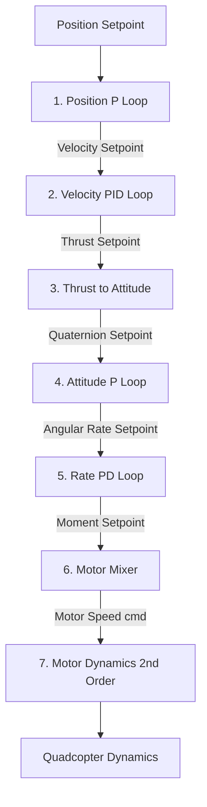
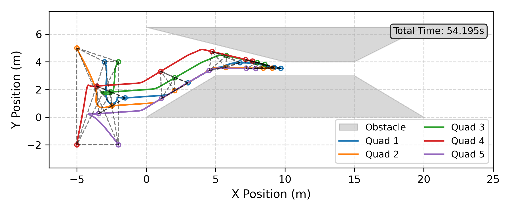
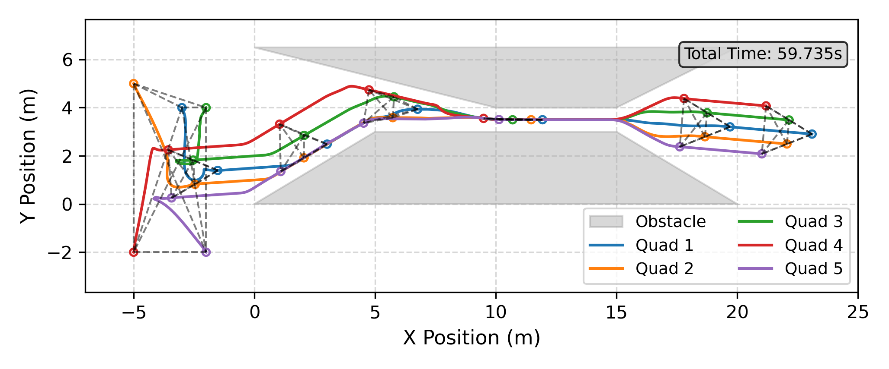
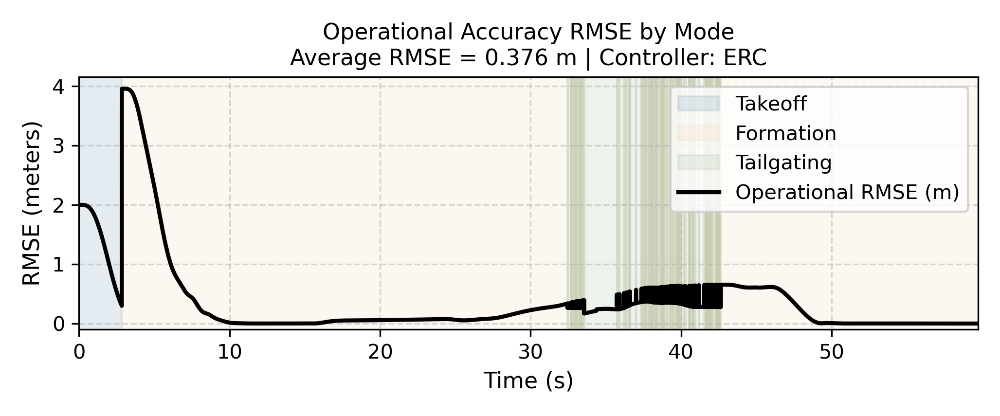
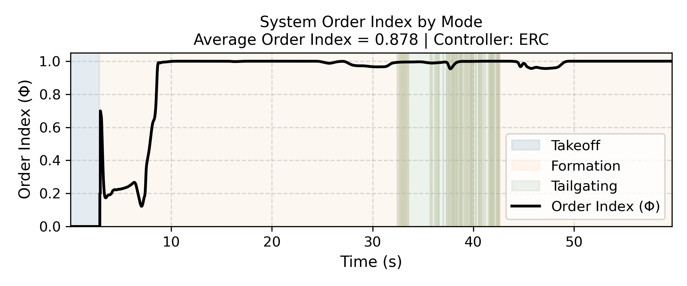
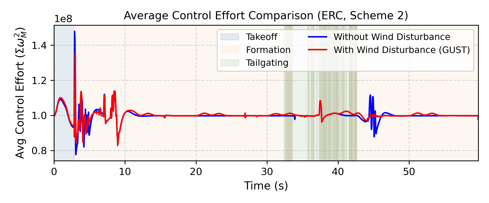

# Coordinated Multi-Quadcopter Simulation: IAPF vs ERC

A distributed simulation system for a homogeneous swarm of multi-quadcopters (5 agents) designed using the Object-Oriented Programming (OOP) paradigm in Python. This repository integrates a white-box quadcopter dynamics model (derived using **Kane's Method**), a cascaded flight control loop (**Cascaded PID**), and decentralized swarm coordination algorithms: **Improved Artificial Potential Field (IAPF)** and **Event-Based Reconfiguration Control (ERC)**.

---

## Table of Contents
1. [Project Overview](#1-project-overview)
2. [Quadcopter Mathematical Model (Kane's Method)](#2-quadcopter-mathematical-model-kanes-method)
3. [Low-Level Controller Architecture (Cascaded PID)](#3-low-level-controller-architecture-cascaded-pid)
4. [Multi-Agent Swarm Coordination Algorithms](#4-multi-agent-swarm-coordination-algorithms)
5. [Simulation Scenarios (Obstacles & Wind)](#5-simulation-scenarios-obstacles--wind)
6. [Results & Comparative Analysis](#6-results--comparative-analysis)
7. [Physical Implementation & Validation Plan](#7-physical-implementation--validation-plan)
8. [Getting Started](#8-getting-started)

---

## 1. Project Overview

This project addresses the challenge of coordinating a swarm of quadcopters to navigate complex, obstacle-dense environments. The swarm must maintain geometric formations, prevent inter-agent collisions, avoid static obstacles, and adapt to narrow environments (such as narrow corridors/passages) under external wind disturbances.

The system is designed around a decentralized hierarchical control architecture:
*   **High-Level Planner**: Computes the collision-free desired position for each agent in real-time based on local sensing and neighbor interactions. Implemented in [MultiAgentMethod in MultiAgentIAPF.py](file:///run/media/izmaherdian/Windows-SSD/Izma_S2_InstrumentasiKontrol_ITB/Akademik/Project%20S1/MultiAgentSim/Agent/MultiAgentIAPF.py) and [MultiAgentMethod in MultiAgentERC.py](file:///run/media/izmaherdian/Windows-SSD/Izma_S2_InstrumentasiKontrol_ITB/Akademik/Project%20S1/MultiAgentSim/Agent/MultiAgentERC.py).
*   **Low-Level Controller**: Drives the physical bodi of each quadcopter to track the reference position. Output signals are mapped to individual rotor speed commands ($w_{cmd}$) and executed by the actuators. Implemented in [QuadControl.py](file:///run/media/izmaherdian/Windows-SSD/Izma_S2_InstrumentasiKontrol_ITB/Akademik/Project%20S1/MultiAgentSim/Agent/QuadControl.py).
*   **Quadcopter Plant**: Models the physical dynamics of the quadcopter (DJI F450 frame parameters) and the motor actuators. The dynamics are integrated in [QuadDynamics.py](file:///run/media/izmaherdian/Windows-SSD/Izma_S2_InstrumentasiKontrol_ITB/Akademik/Project%20S1/MultiAgentSim/Agent/QuadDynamics.py).

---

## 2. Quadcopter Mathematical Model (Kane's Method)

The mathematical model of the quadcopter is derived using **Kane's Method** (Thomas R. Kane, 1985), which is implemented symbolically in the SymPy physics mechanics package via [Quad_3D_frd_NED_Quat.py](file:///run/media/izmaherdian/Windows-SSD/Izma_S2_InstrumentasiKontrol_ITB/Akademik/Project%20S1/MultiAgentSim/Agent/ModelSystemQuad/Quad_3D_frd_NED_Quat.py).

### Why Kane's Method?
Compared to other classical mechanics formulations, Kane's method provides superior computational efficiency for multi-body, non-linear aerospace systems:
1.  **vs Newton-Euler**: Newton-Euler requires calculating internal constraint forces between bodies that do not contribute to the overall motion of the system, adding significant computational overhead. Kane's method naturally eliminates non-working constraint forces.
2.  **vs Lagrange**: Lagrange requires deriving kinetic and potential energy expressions followed by tedious partial differentiation, which is prone to symbolic errors. Additionally, Lagrange yields equations in terms of generalized coordinate accelerations ($\ddot{q}$) that require inverting a large symbolic mass matrix.
3.  **Kane's Advantages**: Kane works with **Generalized Speeds ($u$)** instead of coordinate derivatives, simplifying 3D rotational kinematics. It directly projects active forces ($\mathbf{F}_r$) and inertia forces ($\mathbf{F}_r^*$) onto partial velocities ($\mathbf{v}_r$), yielding equations of motion that are linear in the generalized speed derivatives ($\dot{u}$), bypassing complex mass matrix inversions.

### Coordinate Frames
The model utilizes standard aviation coordinate frames:
1.  **Inertial Frame ($N$)**: Evaluated in **NED** (North, East, Down). The position is denoted as $(x, y, z)$. The $+z$-axis points downward (gravity is positive).
2.  **Body Frame ($B$)**: Orientated in **FRD** (Front, Right, Down). The center of mass is located at $B_{cm}$.
3.  **Wind Frame ($W$)**: Used to evaluate relative air velocity and aerodynamic forces.

### State Variables
The full state vector of the quadcopter plant ($\mathbf{s}_{plant}$) consists of 13 variables:
$$\mathbf{s}_{plant}(t) = \begin{bmatrix} x & y & z & q_w & q_x & q_y & q_z & u_x & u_y & u_z & \omega_\phi & \omega_\theta & \omega_\psi \end{bmatrix}^T$$

1.  **Generalized Coordinates ($\mathbf{q}_{ind}$)**:
    *   Position of the center of mass in $N$: $\mathbf{p} = \begin{bmatrix} x & y & z \end{bmatrix}^T$.
    *   Orientation of frame $B$ relative to $N$ represented as a unit quaternion $\mathbf{q} = \begin{bmatrix} q_w & q_x & q_y & q_z \end{bmatrix}^T$ to avoid singular gimbal lock. It satisfies the normalization constraint: $q_w^2 + q_x^2 + q_y^2 + q_z^2 = 1$.
2.  **Generalized Speeds ($\mathbf{u}_{ind}$)**:
    *   Linear velocities in $N$: $\mathbf{v} = \begin{bmatrix} u_x & u_y & u_z \end{bmatrix}^T$ where $u_x = \dot{x}$, $u_y = \dot{y}$, and $u_z = \dot{z}$.
    *   Body angular velocities relative to $N$, expressed in frame $B$: $\boldsymbol{\omega} = \begin{bmatrix} \omega_\phi & \omega_\theta & \omega_\psi \end{bmatrix}^T$ (commonly referred to as $p, q, r$).

### Kinematic Differential Equations
The relation between the quaternion derivatives ($\dot{\mathbf{q}}$) and angular velocities ($\boldsymbol{\omega}$) is given by:
$$\begin{bmatrix} \dot{q}_w \\ \dot{q}_x \\ \dot{q}_y \\ \dot{q}_z \end{bmatrix} = \frac{1}{2} \begin{bmatrix} -q_x & -q_y & -q_z \\ q_w & -q_z & q_y \\ q_z & q_w & -q_x \\ -q_y & q_x & q_w \end{bmatrix} \begin{bmatrix} \omega_\phi \\ \omega_\theta \\ \omega_\psi \end{bmatrix}$$

### Dynamic Equations
All forces and torques acting on the quadcopter are compiled in `ForceList`:
*   **Gravitational Force**: $\mathbf{F}_g = m_B g \hat{\mathbf{n}}_z$ acting downward.
*   **Actuator Thrust**: Each motor $i$ produces a thrust $\mathbf{T}_{M_i} = -T_i \hat{\mathbf{b}}_z$ (where $T_i = k_{Th} w_i^2$). The motors are placed in an "X" configuration:
    $$\mathbf{p}_{M1} = d_{xm}\hat{\mathbf{b}}_x - d_{ym}\hat{\mathbf{b}}_y - d_{zm}\hat{\mathbf{b}}_z \quad \text{(Front-Left)}$$
    $$\mathbf{p}_{M2} = d_{xm}\hat{\mathbf{b}}_x + d_{ym}\hat{\mathbf{b}}_y - d_{zm}\hat{\mathbf{b}}_z \quad \text{(Front-Right)}$$
    $$\mathbf{p}_{M3} = -d_{xm}\hat{\mathbf{b}}_x + d_{ym}\hat{\mathbf{b}}_y - d_{zm}\hat{\mathbf{b}}_z \quad \text{(Back-Right)}$$
    $$\mathbf{p}_{M4} = -d_{xm}\hat{\mathbf{b}}_x - d_{ym}\hat{\mathbf{b}}_y - d_{zm}\hat{\mathbf{b}}_z \quad \text{(Back-Left)}$$
*   **Actuator Reactive Torque**: $\boldsymbol{\tau}_{M_i} = (-1)^i \tau_i \hat{\mathbf{b}}_z$ where $\tau_i = k_{To} w_i^2$.
*   **Aerodynamic Drag**: $\mathbf{F}_{drag, j} = -C_d \text{sign}(v_{wind, j}) v_{wind, j}^2 \hat{\mathbf{n}}_j$ for $j \in \{x, y, z\}$.
*   **Rotor Gyroscopic Torque**: The gyroscopic precession torque generated by the rotating rotors:
    $$\boldsymbol{\tau}_{gyro} = -I_{Rzz} (\boldsymbol{\omega} \times \Omega_{net} \hat{\mathbf{b}}_z)$$
    where $\Omega_{net} = w_1 - w_2 + w_3 - w_4$ is the cumulative net angular velocity of the rotors.

---

## 3. Low-Level Controller Architecture (Cascaded PID)

To track the 3D position setpoint generated by the High-Level Planner, a cascaded loop controller is implemented in [QuadControl.py](file:///run/media/izmaherdian/Windows-SSD/Izma_S2_InstrumentasiKontrol_ITB/Akademik/Project%20S1/MultiAgentSim/Agent/QuadControl.py):



### Control Loop Breakdown
1.  **Position Control (P)**: Tracks position errors to output a 3D linear velocity setpoint $\mathbf{v}_{sp}$.
2.  **Velocity Control (PID/PD)**: Tracks linear velocity errors to compute the required thrust vector $\mathbf{T}_{sp}$. A feed-forward hover thrust ($m_B g$) is added to prevent vertical drop, and an anti-windup filter limits integration growth.
3.  **Thrust-to-Attitude Mapping**: Combines the direction of the thrust vector $\mathbf{T}_{sp}$ and the desired yaw angle ($\psi_{sp}$) to generate a desired quaternion orientation ($\mathbf{q}_d$).
4.  **Attitude Control (P)**: Computes attitude errors via quaternion multiplication ($\mathbf{q}_e = \mathbf{q}^{-1} \otimes \mathbf{q}_d$) to command desired angular rates $\boldsymbol{\omega}_{sp}$.
5.  **Angular Rate Control (PD)**: Resolves angular velocity errors ($\boldsymbol{\omega}_{error} = \boldsymbol{\omega}_{sp} - \boldsymbol{\omega}$) to output commanded body torques ($\boldsymbol{\tau}_{cmd}$).
6.  **Motor Mixer**: Translates commanded thrust ($F_{total}$) and moments ($\tau_\phi, \tau_\theta, \tau_\psi$) into commanded rotor speeds squared ($w_{cmd}^2$).
7.  **Actuator Dynamics**: Evaluates DC motor responses as a second-order delay system ($\tau = 0.015\text{ s}$) bounded by motor saturation limits (minimum $75\text{ rad/s}$ and maximum $925\text{ rad/s}$).

### Controller Gain Configuration
| Control Loop | Proportional ($K_p$) | Integral ($K_i$) | Derivative ($K_d$) | Saturation Limits |
| :--- | :---: | :---: | :---: | :--- |
| **Position ($x, y$)** | 1.5 | - | - | Velocity: $\pm 5.0\text{ m/s}$ |
| **Position ($z$)** | 1.5 | - | - | Velocity: $\pm 5.0\text{ m/s}$ |
| **Velocity ($x, y$)**| 5.0 | 5.0 | 0.5 | Max Tilt Angle: $50^\circ$ |
| **Velocity ($z$)** | 4.0 | 5.0 | 0.5 | Thrust: $0.1\times 4 \to 9.18\times 4\text{ N}$|
| **Attitude ($\phi, \theta$)**| 8.0 | - | - | Angular Rate: $\pm 200^\circ\text{/s}$ |
| **Attitude ($\psi$)** | 1.5 | - | - | Angular Rate: $\pm 150^\circ\text{/s}$ |
| **Rate ($\phi, \theta$)**| 1.5 | - | 0.04 | Actuator torque limits |
| **Rate ($\psi$)** | 1.0 | - | 0.10 | Actuator torque limits |

---

## 4. Multi-Agent Swarm Coordination Algorithms

Two decentralized high-level planners coordinate the swarm:

### 4.1 Improved Artificial Potential Field (IAPF)
The IAPF algorithm models swarm navigation using superposed virtual force fields. These virtual forces are mapped directly to commanded target velocities ($\mathbf{v}_{ref}^{IAPF}$) for the low-level controller:
$$\mathbf{v}_{ref}^{IAPF} = \mathbf{v}_i^{mig} + \mathbf{v}_{oi}^{obs} + \mathbf{v}_{ii}^{col} + \mathbf{v}_i^{form}$$

Where the behaviors are defined as:
1.  **Migration Force ($\mathbf{v}_i^{mig}$)**: Attracts the agents toward the global goal.
2.  **Obstacle Repulsion ($\mathbf{v}_{oi}^{obs}$)**: Pushes agents away from static obstacles (active within $R_{alert} = 0.6\text{ m}$).
3.  **Inter-agent Collision Avoidance ($\mathbf{v}_{ii}^{col}$)**: Puts repulsive forces between neighboring drones to prevent collisions (active within $R_{alert} = 0.6\text{ m}$).
4.  **Formation Keeping Force ($\mathbf{v}_i^{form}$)**: Forces agents to maintain target geometric configurations relative to their neighbors:
    $$\mathbf{v}_i^{form} = k_{form} \sum_{j=1, j \neq i}^{N} \left[ (\mathbf{p}_j - \mathbf{p}_i) - \kappa (\boldsymbol{\delta}_j^* - \boldsymbol{\delta}_i^*) \right]$$
    where $\kappa$ is the formation scale factor, and $\boldsymbol{\delta}_j^* - \boldsymbol{\delta}_i^*$ is the nominal relative distance between agents $i$ and $j$.

### 4.2 Event-Based Reconfiguration Control (ERC)
ERC extends the rigid behavior of IAPF by adding an adaptive state machine and dynamic formation scaling.

#### 1. Mission State Machine:
*   **TAKEOFF Mode**: All agents climb vertically to the cruising altitude ($z_{target} = -2.0\text{ m}$). Only takeoff and inter-agent collision avoidance are active. The swarm transitions to **MISSION Mode** synchronously once:
    $$|z_i(t) - z_{target}| \leq 0.1\text{ m}, \quad \forall i$$
*   **MISSION Mode**: Activates full swarm coordination, allowing the formation to navigate.

#### 2. Adaptive Logic in Mission Mode:
In MISSION mode, agents dynamically switch behaviors based on environmental clearance in front of them:
$$\mathbf{v}_{ref}^{ERC} = \mathbf{v}_i^{mig} + \mathbf{v}_{oi}^{obs} + \mathbf{v}_{ii}^{col} + \sigma_i \mathbf{v}_i^{form} + (1 - \sigma_i)\mathbf{v}_i^{tail}$$

Where the switching parameter is:
*   $\sigma_i = 1$: **Formation Mode** (maintain target geometry).
*   $\sigma_i = 0$: **Tailgating Mode** (follow the local leader in a single-file line).

This transition is governed by **Free Environmental Width ($w_e$)**:
1.  **Environmental Width Estimation ($w_e$)**: The agent identifies the closest obstacle points on its left ($\mathbf{o}_l$) and right ($\mathbf{o}_r$) sides relative to the heading vector $\mathbf{u}_{ref}$, and projects the distance onto the perpendicular heading axis $\mathbf{u}_{ref}^\perp$:
    $$w_e = \left| \left\langle (\mathbf{o}_r - \mathbf{o}_l), \mathbf{u}_{ref}^\perp \right\rangle \right|$$
2.  **Dynamic Formation Scaling**: If the corridor narrows but remains wider than the safety limit ($w_e - 2R_{robot} < w_f$, where $w_f$ is the nominal formation width), the agent shrinks the formation scale factor $\kappa$:
    $$\kappa = \frac{w_e - 2R_{robot}}{w_f}$$
3.  **Tailgating Transition ($\sigma_i = 0$)**: If the environment narrows past a critical threshold:
    $$w_e \leq \alpha \cdot R_{robot}$$
    where $R_{robot} = 0.2\text{ m}$ and $\alpha = 8$ (Safety limit $= 1.6\text{ m}$).
4.  **Decentralized Leader Election**: When beralih to tailgating, followers elect their leaders by choosing the nearest drone in front:
    $$l_i = \text{arg}\min_{j: p_{ij} > 0} p_{ij} \quad \text{where } p_{ij} = \langle (\mathbf{p}_j - \mathbf{p}_i), \mathbf{u}_{ref} \rangle$$
    If no agent is ahead ($l_i = -1$), the agent acts as the leader of the queue.

---

## 5. Simulation Scenarios (Obstacles & Wind)

The simulation environment in [Obstacles.py](file:///run/media/izmaherdian/Windows-SSD/Izma_S2_InstrumentasiKontrol_ITB/Akademik/Project%20S1/MultiAgentSim/Environment/Obstacles.py) and [Wind.py](file:///run/media/izmaherdian/Windows-SSD/Izma_S2_InstrumentasiKontrol_ITB/Akademik/Project%20S1/MultiAgentSim/Environment/Wind.py) features:

### Obstacle Configurations
*   **Scheme 1 (Basic Obstacle Avoidance)**: 8 random polygonal obstacles of heights ranging from $4.0\text{ m}$ to $7.5\text{ m}$ placed along the path.
*   **Scheme 2 (Narrow Corridor)**: Two angled walls forming a narrow channel of width $1.0\text{ m}$ at the center.
*   **Scheme 3 (U-Trap)**: A concave U-shaped trap to test local minima limitations.

### Wind Disturbance Models
*   **FIXED**: Constant wind of $1.0\text{ m/s}$ blowing from azimuth $180^\circ$ (directly opposing the swarm's movement).
*   **GUST**: A periodic wind gust (10s cycle: active for 4s, inactive for 6s). When active, the wind velocity fluctuates with a $2.0\text{ m/s}$ amplitude above a base of $2.0\text{ m/s}$ (peaking at $4.0\text{ m/s}$).

---

## 6. Results & Comparative Analysis

The performance of IAPF and ERC algorithms was evaluated in Python and analyzed using the visualization tools.

### 6.1 Narrow Corridor Navigation (Scheme 2)
In the narrow corridor scenario (Scheme 2), the channel width ($1.0\text{ m}$) is smaller than the nominal width of the V-shape formation ($2.0\text{ m}$):

*   **IAPF (Failure)**: The static IAPF planner fails to navigate through the corridor. Because the formation is rigid, the repulsive force from the corridor walls balances the attractive migration force to the goal. The agents get stuck and hover indefinitely at the entrance.
    
    
    *Figure 1: Swarm trajectory under static IAPF in Scheme 2, showing stagnation at the entrance due to formation rigidity.*

*   **ERC (Success)**: The adaptive ERC planner successfully passes through the corridor, completing the mission in **59.735 seconds**. As the corridor narrows, the agents scale down the formation and then transition into tailgating mode. Drones fly in a single-file line through the corridor and reconstruct the V-shape formation once they exit.
    
    
    *Figure 2: Swarm trajectory under adaptive ERC in Scheme 2, showing successful formation scaling and tailgating transition.*

### 6.2 Quantitative Metrics
To evaluate the stability and coordination of the swarm under ERC, the tracking error and velocity alignment index were analyzed:

*   **Tracking Accuracy**: The Root-Mean-Square Error (RMSE) of the swarm relative to the planned trajectory shows transient peaks during mode transitions (around $t \approx 32\text{ s}$ and $t \approx 48\text{ s}$), but stabilizes quickly to low values. The average RMSE is $\bar{\text{RMSE}}_{total} = 0.692\text{ m}$.
    
    
    *Figure 3: Swarm tracking RMSE over time, demonstrating convergence and stability across mode transitions.*

*   **Velocity Cohesion**: The Regularity Index ($\Phi$) measures velocity alignment, where $\Phi = 1.0$ represents perfect alignment. Under ERC, the index maintains a high average of $0.878$, demonstrating strong cohesion even during reconfigurations.
    
    
    *Figure 4: Swarm regularity index (Phi) over time, showing cohesive movement throughout the flight.*

### 6.3 Wind Disturbance Rejection (Scheme 2 with GUST Wind)
Under periodic GUST wind disturbances, the swarm completes the mission in the exact same time (**59.735 seconds**), showing high robustness. The average tracking error remains low ($\bar{\text{RMSE}}_{total} = 0.694\text{ m}$), and the regularity index increases slightly to $0.925$.

Although the high-level flight trajectory remains unaffected, the impact of the wind is visible at the actuator level. The average control effort (rotor commands) oscillates significantly as the low-level cascaded PID controllers work to cancel out wind forces:


*Figure 5: Control effort comparison (RMS of commanded motor speed commands) showing high-frequency actuator oscillations under gust wind.*

### 6.4 U-Trap Limitations
Both planners fail in the U-Trap scenario. Because the obstacle avoidance and corridor detection are purely reactive and lateral, the agents cannot detect frontal bolls, causing them to get trapped in a local minimum.

---

## 7. Physical Implementation & Validation Plan

To validate the simulation on hardware, a decentralized architecture has been planned:

### Hardware Stack
*   **Onboard Computer (OBC)**: Nvidia Jetson Nano (runs ROS/ROS2, processes high-level IAPF/ERC planners).
*   **Flight Controller (FC)**: Pixhawk (runs PX4 firmware, executes low-level cascaded PID attitude and rate control).
*   **Localization Sensor**: Decawave DWM1000 UWB (Ultra-Wideband) modules for indoor relative positioning, or RTK-GPS for outdoor flight.
*   **Obstacle Sensor**: 2D/3D LiDAR (e.g., RPLiDAR) to detect obstacles and estimate the environmental width ($w_e$).
*   **Communication**: Wi-Fi Mesh network for real-time state exchange (position, velocity) between OBCs.

### 4-Phase Validation Plan
1.  **Phase 1: Single Agent Reliability**
    *   Flash PX4 firmware to the Flight Controller.
    *   Tune low-level attitude and rate PID loops on a test stand.
    *   Establish MAVLink offboard communication between the Jetson Nano and Pixhawk.
2.  **Phase 2: Swarm Sensing**
    *   Calibrate UWB modules to verify relative distance estimation.
    *   Set up Wi-Fi Mesh to broadcast state data.
    *   Interface LiDAR with Jetson Nano to verify 2D boundary extraction.
3.  **Phase 3: Onboard Integration**
    *   Deploy decentralized planners (IAPF/ERC) as ROS2 nodes on the Jetson Nano.
    *   Validate software in Hardware-in-the-Loop (HITL) simulations with Gazebo.
4.  **Phase 4: Flight Testing**
    *   *1 Quad*: Hover and offboard waypoint tracking tests.
    *   *2 Quads*: Collision avoidance test using UWB relative position.
    *   *3-5 Quads*: Static formation flight.
    *   *Full Mission*: Navigate through a physical narrow corridor to validate ERC formation scaling and tailgating.

---

## 8. Getting Started

### Prerequisites
The simulation runs on Python 3.12. Install the dependencies listed in [requirement.txt](file:///run/media/izmaherdian/Windows-SSD/Izma_S2_InstrumentasiKontrol_ITB/Akademik/Project%20S1/MultiAgentSim/requirement.txt):
```bash
pip install numpy==1.26.4 scipy==1.15.2 sympy==1.13.3 matplotlib==3.9.4
```

### Running the Simulation
1.  Configure the settings in [MultiAgentConfig.py](file:///run/media/izmaherdian/Windows-SSD/Izma_S2_InstrumentasiKontrol_ITB/Akademik/Project%20S1/MultiAgentSim/Agent/MultiAgentConfig.py):
    *   `self.CONTROLLER`: Choose `'erc'` or `'iapf'`.
    *   `self.OBSTACLE_SCHEME`: Choose `'scheme1'` (basic obstacles), `'scheme2'` (narrow corridor), `'scheme3'` (U-trap), or `'NONE'`.
    *   `self.WIND_TYPE`: Choose `'NONE'` (no wind), `'FIXED'` (constant wind), or `'GUST'` (periodic gust).
    *   `self.PATH_TYPE`: Choose `'goal'` (single goal), `'multi-goal'` (waypoints), or `'circular'` (circular path).
2.  At the bottom of [main.py](file:///run/media/izmaherdian/Windows-SSD/Izma_S2_InstrumentasiKontrol_ITB/Akademik/Project%20S1/MultiAgentSim/main.py), choose which simulation to call:
    *   Single quadcopter: call `main()`
    *   Multi-agent swarm: call `main_multi_agent()`
3.  Run the simulation:
    ```bash
    python main.py
    ```

### Analyzing Simulation Logs
Use the scripts in the [Visualization/](file:///run/media/izmaherdian/Windows-SSD/Izma_S2_InstrumentasiKontrol_ITB/Akademik/Project%20S1/MultiAgentSim/Visualization) directory to post-process flight data:
*   [analysis_for_report.py](file:///run/media/izmaherdian/Windows-SSD/Izma_S2_InstrumentasiKontrol_ITB/Akademik/Project%20S1/MultiAgentSim/Visualization/analysis_for_report.py): Generates comparison plots for RMSE, Regularity Index ($\Phi$), velocities, and scale factors.
*   [analysis_quadcopter.py](file:///run/media/izmaherdian/Windows-SSD/Izma_S2_InstrumentasiKontrol_ITB/Akademik/Project%20S1/MultiAgentSim/Visualization/analysis_quadcopter.py): Plots quadcopter physical responses (Euler angles, body angular rates, and motor speed).
*   [generate_plots.py](file:///run/media/izmaherdian/Windows-SSD/Izma_S2_InstrumentasiKontrol_ITB/Akademik/Project%20S1/MultiAgentSim/Visualization/generate_plots.py): Generates the specific result plots embedded in this README.

---

## 9. Citation

If you find this simulation codebase or the methodology useful in your academic research, please cite our corresponding journal paper:

### Plain Text
Herdian, I. A., Ekawati, E., Mukhlish, F., & Prabaswara, P. (2026). Decentralized formation control system design for swarm quadcopters using an improved artificial potential field and event-based reconfiguration control. *Journal of King Saud University – Engineering Sciences*, 38(5), 41. https://doi.org/10.1007/s44444-026-00111-4

### BibTeX
```bibtex
@article{Herdian2026,
  author    = {Herdian, Izma Alhazmi and Ekawati, Estiyanti and Mukhlish, Faqihza and Prabaswara, Pramoda},
  title     = {Decentralized formation control system design for swarm quadcopters using an improved artificial potential field and event-based reconfiguration control},
  journal   = {Journal of King Saud University -- Engineering Sciences},
  volume    = {38},
  number    = {5},
  pages     = {41},
  year      = {2026},
  doi       = {10.1007/s44444-026-00111-4},
  url       = {https://doi.org/10.1007/s44444-026-00111-4}
}
```

